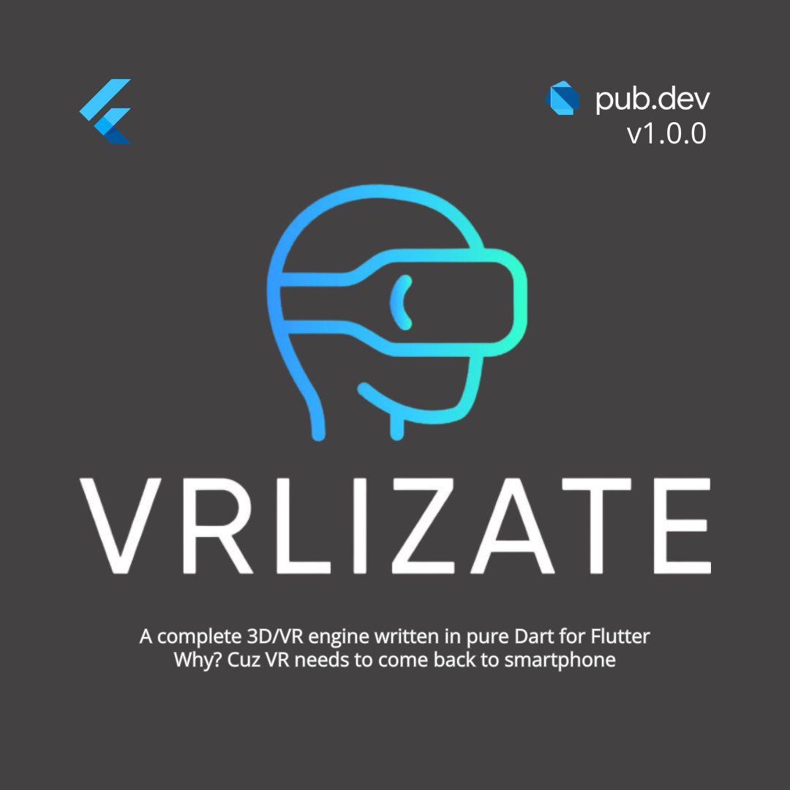

<p align="center">
  
</p>

# VRlizate

**Español** · [English](#english)

VRlizate es un motor 3D/VR Open Source escrito en Dart para crear experiencias
inmersivas accesibles desde smartphones y aplicaciones Flutter. El objetivo de
la versión 0.1 es ofrecer un núcleo pequeño, verificable y extensible: un mismo
formato de escenas e interacción que pueda adaptarse desde teléfonos económicos
hasta dispositivos con seguimiento avanzado.

> Estado: experimental. Las API pueden evolucionar antes de estabilizar la
> versión 0.1. No se recomienda todavía para funciones médicas o de seguridad
> críticas.

## Principios

- **Accesible:** el nivel Lite prioriza 3DoF, gaze y dispositivos modestos.
- **Progresivo:** una experiencia puede añadir controles, iluminación y 6DoF
  cuando el hardware los soporte.
- **Extensible:** sensores y controles comunitarios implementan
  `VrInputDriver` sin acoplarse a una escena.
- **Predecible:** el camino de entrada a 60–120 Hz reutiliza eventos mediante un
  pool de capacidad fija.
- **Abierto:** código Apache 2.0, decisiones documentadas y contribuciones
  verificadas por tests.

Consulta [ARCHITECTURE.md](ARCHITECTURE.md) para ver los niveles Lite, Standard
y Pro, así como el flujo completo entre sensores, interacción y renderizado.

## Requisitos

- Flutter compatible con Dart `>=3.10.8 <4.0.0`.
- Un dispositivo, simulador o plataforma de escritorio soportada por Flutter.
- Giroscopio para seguimiento de cabeza en un teléfono físico. Escritorio y web
  pueden utilizar sus entradas de respaldo.

## Clonar y verificar

```bash
git clone https://github.com/Open-Neom/vrlizate.git
cd vrlizate
flutter pub get
flutter test
flutter analyze
```

Para ejecutar la aplicación de demostración:

```bash
cd example
flutter pub get
flutter run
```

Usa `flutter devices` para seleccionar explícitamente un teléfono o una
plataforma de escritorio.

## Crear una experiencia mínima

Añade el paquete a tu `pubspec.yaml` y construye una escena con la API pública:

```dart
import 'dart:ui';

import 'package:vector_math/vector_math.dart';
import 'package:vrlizate/vrlizate.dart';

final engine = VREngine();

void createExperience() {
  engine.cameraRig.position = Vector3(0, 1.6, 3);
  engine.scene.add(
    LitMeshNode(
      name: 'welcome-cube',
      geometry: CubeGeometry(size: 1),
      material: PBRMaterial(color: const Color(0xFF2E90FA)),
    ),
  );
  engine.enableHeadTracking();
  engine.enableGazePointer(dwellDuration: 1.5);
  engine.start();
}
```

La carpeta [`example/`](example/) contiene escenas más completas. Mantén la
lógica particular de tu experiencia fuera del núcleo y compón módulos mediante
las API públicas de escena, interacción, locomoción y entrada.

## Crear un driver de entrada

`VrInputArbiter` aplica la prioridad `remotePhone/touch > periféricos > gaze`.
Una interacción aceptada se entrega síncronamente; un dwell de gaze queda
suprimido durante 400 ms después de la última actividad de mayor prioridad.

```dart
final class CommunityGamepadDriver implements VrInputDriver {
  VrInputSink? _sink;
  final Map<String, dynamic> _axisPayload = <String, dynamic>{
    'x': 0.0,
    'y': 0.0,
  };

  @override
  VrInputSource get source => VrInputSource.gamepad;

  @override
  void attach(VrInputSink sink) {
    _sink = sink;
    // Suscríbete aquí a la API del gamepad.
  }

  void onAxis(double x, double y) {
    final sink = _sink;
    if (sink == null) return;

    _axisPayload['x'] = x;
    _axisPayload['y'] = y;
    final event = sink.acquire(
      type: VrInputType.navigate,
      data: _axisPayload,
      active: x.abs() > 0.1 || y.abs() > 0.1,
    );
    try {
      sink.submit(event);
    } finally {
      sink.release(event);
    }
  }

  @override
  void detach() {
    // Cancela aquí las suscripciones nativas.
    _sink = null;
  }
}

final arbiter = VrInputArbiter();
final gamepad = CommunityGamepadDriver();

arbiter.addListener((event) {
  // El evento es memoria prestada: úsalo solo dentro de este callback.
});
arbiter.attachDriver(gamepad);
```

No conserves una referencia a un evento después del callback. Si necesitas
historial, copia solamente los valores requeridos. Reutiliza también el payload
del driver cuando este se emita cada frame.

## Módulos principales

```text
lib/
├── core/          Cámara, motor, entrada, matemáticas, proyección y render
├── scene/         Grafo de escena, geometrías, materiales, luces y texturas
├── interaction/   Raycast, objetos interactivos y locomoción
├── spatial_ui/    Paneles, texto y botones espaciales
├── animation/     Clips, esqueletos, keyframes y skinning
├── physics/       Cuerpos rígidos y colisiones
├── effects/       Distorsión, niebla, bloom, SSAO y viñeta
├── loaders/       Carga de glTF/GLB
└── xr/            Integraciones XR
```

## Contribuir

Lee [CONTRIBUTING.md](CONTRIBUTING.md) antes de abrir un cambio. Todo cambio de
comportamiento debe incluir tests; las rutas ejecutadas cada frame deben evitar
asignaciones accidentales y documentar sus límites de hardware.

## Licencia

Apache License 2.0. Consulta [LICENSE](LICENSE).

---

## English

VRlizate is an open-source 3D/VR engine written in Dart for immersive
experiences on smartphones and Flutter applications. The 0.1 goal is a small,
testable, extensible core: one scene and interaction model that scales from
low-end phones to devices with advanced tracking.

> Status: experimental. APIs may evolve before 0.1 is stabilized. Do not use
> the project for safety-critical or medical functions yet.

## Principles

- **Accessible:** Lite prioritizes 3DoF, gaze, and modest devices.
- **Progressive:** experiences can add controllers, lighting, and 6DoF when the
  hardware supports them.
- **Extensible:** community sensors and controllers implement `VrInputDriver`
  without coupling themselves to a scene.
- **Predictable:** the 60–120 Hz input path reuses fixed-pool events.
- **Open:** Apache 2.0 code, documented decisions, and test-backed changes.

Read [ARCHITECTURE.md](ARCHITECTURE.md) for the Lite, Standard, and Pro tiers
and the complete sensor-to-rendering data flow.

## Requirements and verification

- Flutter with Dart `>=3.10.8 <4.0.0`.
- A Flutter-supported device, simulator, or desktop platform.
- A gyroscope for head tracking on a physical phone.

```bash
git clone https://github.com/Open-Neom/vrlizate.git
cd vrlizate
flutter pub get
flutter test
flutter analyze
```

Run the example application with:

```bash
cd example
flutter pub get
flutter run
```

The minimal scene and driver examples in the Spanish sections above use the
same language-independent Dart API. Experience-specific logic should live
outside the engine and compose the public scene, interaction, locomotion, and
input modules.

## Adding an input driver

Implement `VrInputDriver`, keep the `VrInputSink` received by `attach`, and
cancel every hardware subscription in `detach`. For high-frequency values:

1. Reuse payload storage.
2. Call `sink.acquire`.
3. Call `sink.submit` inside a `try` block.
4. Always call `sink.release` in `finally`.
5. Never retain an event delivered to an arbiter listener.

`VrInputArbiter` enforces `remotePhone/touch > peripherals > gaze`. A gaze dwell
is suppressed for 400 ms after the last active higher-priority event, while
gaze hover remains available for reticle feedback.

## Contributing and license

Read [CONTRIBUTING.md](CONTRIBUTING.md) before opening a change. Behavioral
changes require tests, and per-frame paths must avoid accidental allocations.
VRlizate is licensed under [Apache License 2.0](LICENSE).
